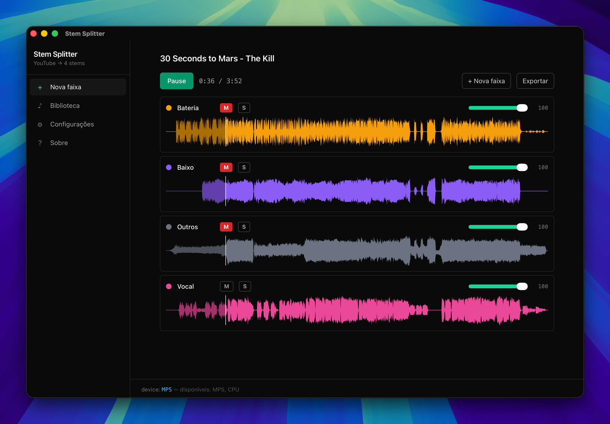

# Stem Splitter

Desktop app que recebe URL do YouTube e separa a música em 4 stems (vocal, bateria, baixo, outros) usando Demucs (`htdemucs_ft`) **localmente**, sem enviar áudio pra nenhum servidor.

Após o processamento, a faixa fica disponível na biblioteca pra reprodução com mixer (mute/solo/volume) e export por stem.

> Uso pessoal/educacional — baixar do YouTube viola os termos de serviço da plataforma.
